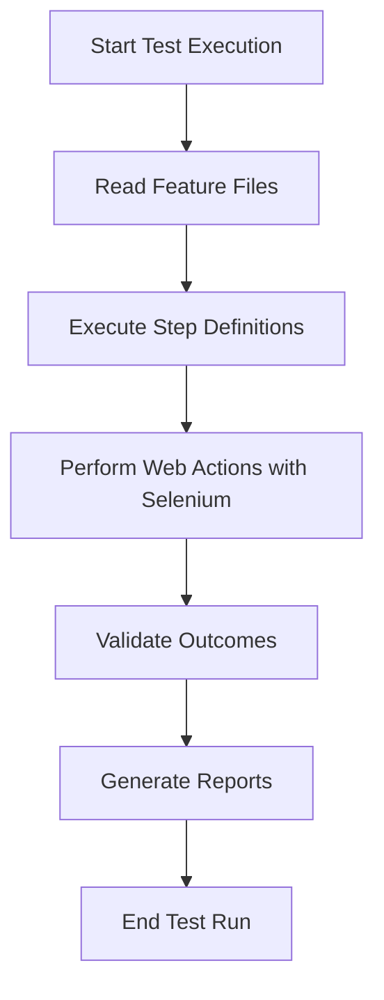

# Cucumber-Demo_BDDFramework
[readmemd-tecorb-developerscucumber-demo-bddframework.md](https://github.com/user-attachments/files/22740826/readmemd-tecorb-developerscucumber-demo-bddframework.md)
# Cucumber-Demo_BDDFramework

## Introduction

Cucumber-Demo_BDDFramework is a sample project demonstrating the implementation of a robust Behavior Driven Development (BDD) framework using Cucumber. This repository is designed to showcase best practices for automating acceptance tests with Cucumber, integrating Selenium WebDriver, and structuring test automation code for maintainability and scalability. It is ideal for teams looking to adopt BDD for their web application testing needs.

## Installation

To get started with the Cucumber-Demo_BDDFramework, clone the repository and install the required dependencies. The setup process is straightforward and suitable for both beginners and experienced QA engineers.

```bash
git clone https://github.com/TecOrb-Developers/Cucumber-Demo_BDDFramework.git
cd Cucumber-Demo_BDDFramework
```

Install the required dependencies:

```packagemanagers
{
    "commands": {
        "npm": "npm install",
        "yarn": "yarn install",
        "pnpm": "pnpm install",
        "bun": "bun install"
    }
}
```

Make sure to install Java (JDK 8 or higher) and Maven if you intend to use the Java version of the framework.

## Features

- Implements BDD using Cucumber and Gherkin syntax.
- Supports Selenium WebDriver for browser automation.
- Modular code structure for easy maintenance and scalability.
- Integration with popular test runners (e.g., JUnit, TestNG).
- Parameterization and data-driven testing.
- Easy configuration of browsers and environments.
- Detailed HTML test reports for easy analysis.
- Page Object Model (POM) design pattern.

## Requirements

Before running the framework, ensure your system meets the following requirements:

- Java JDK 8 or higher
- Maven 3.6+ (if using Java version)
- Node.js 12+ (if using JavaScript version)
- Compatible browsers and respective WebDriver executables (e.g., ChromeDriver for Google Chrome)
- Git for version control
- (Optional) IDE like IntelliJ IDEA, Eclipse, or VS Code

## Usage

Follow these steps to execute your BDD tests using the framework:

1. Clone the repository and install dependencies as described in the Installation section.
2. Update configuration files as needed (e.g., browser choice, environment URLs).
3. Write your feature files in the `features` directory using Gherkin syntax.
4. Implement step definitions to map feature file steps to automation code.
5. To execute tests, use the relevant command:

For Java (Maven):
```bash
mvn test
```

For JavaScript (if applicable):
```bash
npm test
```

6. After execution, view the HTML reports generated in the `reports` directory.

### Example Feature File

```gherkin
Feature: User Login

  Scenario: Successful login with valid credentials
    Given I am on the login page
    When I enter valid username and password
    And I click on the login button
    Then I should see the dashboard
```

### Example Test Run Flow



## Configuration

The framework offers flexible configuration options to suit different environments and requirements. Key configuration files include:

- `config.properties` or `application.properties`: Set base URLs, browser options, and environment variables.
- `pom.xml` or `package.json`: Manage dependencies and plugins.
- `testng.xml` or JUnit runner files: Control test execution and suite settings.

### Common Configuration Options

- **Browser Setup:** Specify the browser (Chrome, Firefox, etc.) and driver paths.
- **Base URL:** Set the application under test’s URL.
- **Timeouts:** Adjust implicit and explicit wait times.
- **Reporting:** Enable or configure HTML, JSON, or other report formats.

### Sample Configuration (config.properties)

```properties
browser=chrome
baseUrl=https://example.com
timeout=30
report.path=./reports
```

Adjust these values as per your test environment and needs.

---

This framework serves as a starting point for BDD-based web automation. Extend it by adding more feature files, step definitions, and page objects to cover your application’s functionality. For further details, refer to the comments and documentation within the source code.
